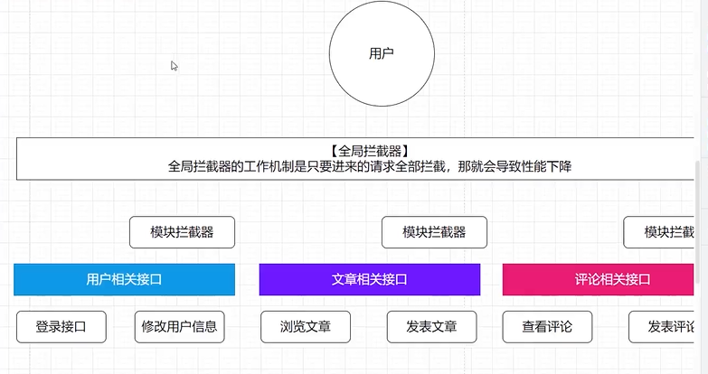

flask 教程:
https://osgeo.cn/flask/

python 教程:
https://docs.python.org/zh-cn/3/tutorial/index.html

python 语法教程:
https://www.w3school.com.cn/python/python_inheritance.asp

sqlalchemy 教程:
https://osgeo.cn/sqlalchemy/tutorial/engine.html


创建虚拟环境:
```
python -m venv venv
```
激活虚拟环境:

```
source venv/bin/activate
```

生成requirements.txt: 文件
```
pip freeze > requirements.txt
```

# 拦截器的基本概念
拦截器（Interceptor）是Spring AOP（Aspect Oriented Programming）中的一个概念，它允许在方法调用前后执行额外的逻辑。

工作原理:
拦截器可以用于实现日志记录、性能监控、安全验证等功能.

拦截器在Spring AOP中，通常被定义为切面（Aspect），切面是一个类，该类包含多个方法，这些方法可以添加到目标对象中的方法中，从而实现拦截。

全局拦截器

模块拦截器


# AI 数据化引擎价格方案解析

LLM + TEXT2sql + DSL
大模型 + text2sql + dsl + 项目渲染器/ JSON schema 设计.
- 模型部署.
- shadowcn - taliwandcs , pian
- langchianjs 、ollama、qwen2.06b. + SSE
- 服务端ai 能力集成.
- 模型本地化部署.

text to sql
data to chart

### 项目搭建nuxt 框架.


### 什么是 SQLAIchemy框架
SQLAlchemy 是一个 Python 语言的 SQL 工具包和对象关系映射（ORM）库。它提供了一个高级的 SQL 表达式语言，用于数据库查询和操作，同时也支持数据库迁移和数据库模式定义。

https://osgeo.cn/sqlalchemy/tutorial/engine.html

SQLAlchemy 的主要功能包括：
1. 提供了一个高级的 SQL 语言，用于数据库查询和操作。
2. 支持数据库迁移，即对数据库进行版本控制，以便在应用程序的版本之间进行升级和降级。
3. 提供了一个 ORM 层，用于将数据库表映射到 Python 类，使得数据库操作更加方便和直观。
4. 支持多种数据库后端，包括 MySQL、PostgreSQL、SQLite 等。
5. 提供了一个异步支持，用于在异步应用程序中使用 SQLAlchemy。
6. 提供了一个 SQL 生成器，用于生成 SQL 语句，并支持多种数据库后端。
7. 提供了一个连接池，用于管理数据库连接，并提高性能。

### 创建数据库连接


